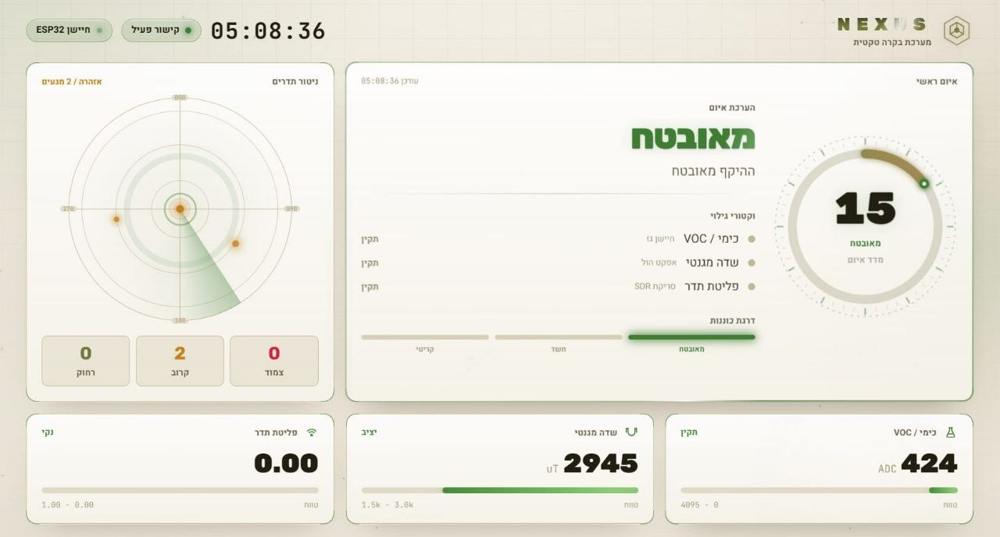
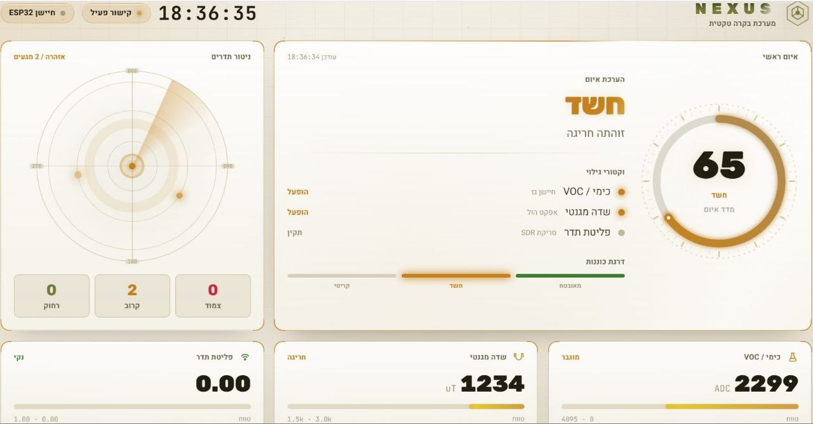

# NEXUS: Autonomous Threat Detection and Sensor Fusion System

## Overview
NEXUS is an advanced, autonomous tactical command platform designed for standoff threat detection in high-interference and contested environments. Built for B2G (Business-to-Government) applications, the system utilizes a multi-layered sensor fusion architecture to identify hidden surveillance cameras, explosive devices, and environmental anomalies without endangering human life.

## System Architecture

The NEXUS system operates through a robust three-tier architecture, designed for real-time response and data integrity in high-interference environments:

1.  **Sensor Layer (Edge Node):**
    *   **Hardware:** ESP32 microcontrollers interface with an array of analog and digital sensors (Gas/VOC, Magnetic, WiFi spectral scanning).
    *   **Processing:** Data is pre-processed and filtered on-chip using Moving Average algorithms to eliminate environmental noise before transmission.

2.  **Communication Layer (Tactical Telemetry):**
    *   **Protocol:** Critical threat assessments and telemetry data are encapsulated into lightweight packets and transmitted via **LoRa (868MHz)**.
    *   **Resilience:** This layer ensures operational continuity up to 5km+ in GPS-denied or contested environments, completely bypassing the need for cellular or internet infrastructure.

3.  **Intelligence & Command Layer (C4ISR):**
    *   **Backend:** A Python-based **FastAPI** server ingests raw telemetry through a Serial-to-WebSocket gateway.
    *   **AI Engine:** A Raspberry Pi 5 performs high-fidelity computer vision tasks, running concurrent **YOLOv8-World** models to identify and classify visual threats (CCTV, optics, concealed wiring).
    *   **Frontend:** A modern **React 19** dashboard provides a real-time Tactical Picture (COP), featuring dynamic radar scopes, live telemetry streams, and autonomous threat-level scoring.

---

## Key Features
* **Visual AI Intelligence**: Employs the YOLOv8-World model on edge processing units (Raspberry Pi 5) for real-time visual identification and classification of hardware threats.
* **Spectrum RF Analysis**: Integrates RTL-SDR modules to monitor radio frequencies and detect energy spikes associated with standoff remote triggers.
* **Stealth WiFi Radar**: An ESP32-based network scanner that triangulates wireless espionage hardware using signal strength (RSSI) and manufacturer MAC address databases.
* **Environmental Anomaly Detection**: Real-time chemical (VOC) and magnetic field monitoring utilizing moving average algorithms to establish dynamic baselines.
* **Off-Grid Resilience**: Secure field-to-command telemetry via LoRa (868MHz) protocol, providing 5km+ range in communications-denied environments.
* **C4ISR Dashboard**: A tactical React/FastAPI interface featuring live data streams, dynamic radar scopes, and a unified threat scoring index.

---

## System Showcase

### Project Demonstration
[Click here to watch the tactical demo video](https://drive.google.com/file/d/1xykrWBW1Ufxt357D1i5TMyZyMMQQcc9s/view?usp=sharing)

### Real-Time Dashboard States

| System Secure (Safe Mode) | Threat Detected (Critical Alert) |
|:---:|:---:|
|  |  |
| *System monitors environmental metrics and maintains a normal baseline.* | *System alerts upon visual detection of a camera and an SDR frequency spike.* |

---

## Technology Stack
* **Software**: Python (FastAPI, NumPy, OpenCV), React, TypeScript, Vite, Tailwind CSS.
* **AI Models**: Ultralytics YOLOv8-World.
* **Embedded**: C++, Arduino IDE, LoRa (SX1278), RTL-SDR.
* **Hardware**: Raspberry Pi 5, ESP32, MQ-Series Gas Sensors, Hall-Effect Magnetic Sensors.

---

## Installation & Setup

### 1. Embedded Setup (ESP32)
1. Open `sensor_node.ino` and `gateway_node.ino` from the `embedded` folder.
2. Flash the units using Arduino IDE (ensure LoRa libraries are installed).

### 2. Backend Setup (FastAPI)
1.  Navigate to the backend folder:
    ```bash
    cd backend
    ```
2.  Set up and activate a virtual environment:
    ```bash
    python -m venv .venv
    # Windows:
    .venv\Scripts\activate
    # Mac/Linux:
    source .venv/bin/activate
    ```
3.  Install requirements:
    ```bash
    pip install -r requirements.txt
    ```
4.  Run the server:
    ```bash
    uvicorn main:app --port 8800
    ```

### 3. Frontend Setup (React)
1.  Open a new terminal and navigate to the frontend folder:
    ```bash
    cd frontend
    ```
2.  Install dependencies:
    ```bash
    npm install
    ```
3.  Launch the dashboard:
    ```bash
    npm run dev
    ```

---
 
**Find it. Before it finds you.**